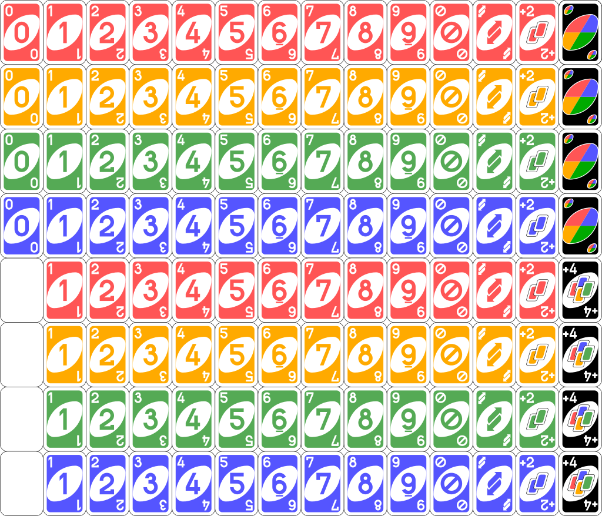

# UNO
In this project the UNO card game was recreated in Python command line (without graphical interfaces), following the original rules.

# Folder subdivision
The project has been divided into two folders enums and models.